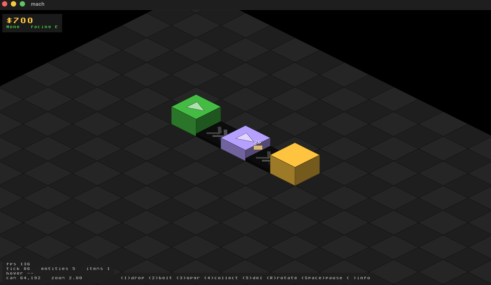

# mach

A game engine and the game it exists to run, built together as one thing. Pure C,
SDL3, and not much else.



**Version:** v0.5.0

It's a small **2D isometric** engine driving a factory/automation game. The
rendering is plain 2D on top of SDL_Renderer — no shaders, no GPU pipeline, no
offline shader tooling. There used to be all of that; it got cut. (Real 3D comes
back when there's an actual reason for it and not a day sooner — see
`ARCHITECTURE.md` for why.)

## Building it

You need a C compiler and SDL3. That's the whole list. SDL3 comes in as a git
submodule and gets built once by the setup script.

**macOS / Linux** (bash):
```bash
./scripts/setup.sh      # once: build SDL3, fetch stb
./build.sh              # build the game
./build/mach_debug      # run it
```

**Windows** — from an elevated *Visual Studio "x64 Native Tools"* `cmd` prompt:
```bat
scripts\setup.bat       :: once: build SDL3 (cmake + MSVC), fetch stb
build.bat               :: build the game
build\mach_debug.exe    :: run it
```
The `.bat` files just call the PowerShell scripts, so don't go looking for
duplicate logic in them.

### What you actually need

- **A C compiler and SDL3.** SDL_Renderer ships inside SDL3 and gives you
  hardware-accelerated 2D on whatever's native — Metal, Vulkan, D3D. There's no
  shader toolchain to install, no GPU SDK, nothing extra. That's the entire point
  of staying on SDL_Renderer.
- **stb**, fetched by setup: `stb_image.h` for loading sprite art. Public domain,
  single header, nothing to build.

## Playing with it

- **WASD / Arrows** — pan the camera
- **Scroll wheel** — zoom
- **1 / 2 / 3** — pick the Miner / Storage / Delete tool (hit it again to drop it)
- **Left click** — apply the current tool to the tile you're hovering
- **Esc** — quit

## Hacking on it

If you use Emacs, generate tags:
```bash
./scripts/tags.sh
```
and point your init at them:
```elisp
(setq tags-file-name "/path/to/mach/TAGS")
(define-key global-map "\C-]" 'find-tag)
(define-key global-map "\C-\M-]" 'pop-tag-mark)
```
`C-]` jumps to a definition, `C-M-]` jumps back.

## Why it's built this way

**Pure C, no frameworks.** SDL3 handles the window, input, and rendering. Past
that it's just C.

**Unity build.** The whole thing compiles in one `clang` call — `mach.c` includes
every other `.c` file and the compiler sees it all at once. There's no build
system to speak of; `build.sh` is the compiler invocation. If that sounds strange,
go watch some Handmade Hero and look at how RAD Debugger builds. It's freeing.

**Engine and game, kept apart.** The engine — rendering, input, windowing — lives
in `src/engine/`. The game — entities, rules, content — lives in `src/game/`. The
dependency only ever points one way: **`src/engine/` never names a game type.** The
game owns the loop in `main()` and calls into the engine, raylib-style; the engine
drives nothing on its own. Swap in a different game and `src/engine/` doesn't have
to notice.

**Minimal, and 2D on purpose.** Isometric is a coordinate transform, not a 3D
projection — the "3D look" is faked with shaded, outlined blocks. The engine stays
small and gets new capability only when something concrete actually pulls it in.

**Fat-struct ECS.** No generic component system, no query engine. Each entity type
is a full struct (`Entity_Miner`, `Entity_Storage`) and the game logic touches the
data directly. The idea is lifted from Anton Mikhailov on the *Wookash Podcast*.

## Where it runs

- macOS — primary, this is where it's developed and tested
- Linux — toolchain's wired, needs a real run on real hardware
- Windows — same story

Dropping SDL_GPU made the cross-platform story boring in the best way: no shader
toolchain, no per-backend bytecode. SDL_Renderer picks the native 2D backend on
each platform by itself. Build SDL3, bring a C compiler, go.

## How the code is laid out

```
src/
  engine/                 # the reusable part
    base/                 # fundamental types (i32, f32, b32, ...)
    math/                 # Vec2 + ops, Vec4 for color, scalar helpers
    mem/                  # arena allocator (region list, free/reset whole)
    core/                 # frame-loop steps, timing, window lifecycle
    render/               # 2D renderer: render2d (SDL_Renderer + iso), font, image
    ui.h                  # window context
    debug.h               # assertions, leveled logging

  game/                   # the factory sim
    app.c                 # glue: the one file that knows both the engine and the game
    game.h/.c             # game state, input, the 2D iso camera, hover-picking
    render_game.h/.c      # draws the world as iso tiles and shaded blocks
    world/                # entities and the grid simulation

  mach.c                  # unity root: includes everything, defines main()

build.sh / build.bat      # the compiler invocation (macOS-Linux / Windows)
scripts/setup.sh / .ps1   # build SDL3, fetch stb — run once
third_party/SDL/          # SDL3 submodule
```

`ARCHITECTURE.md` has the longer version of why any of this is the way it is.

## The entity system

Entities are **fat structs**, not generic bags of components:
```c
typedef struct {
    i32 grid_x, grid_y;
    i32 ore_stored;
    i32 ore_capacity;
} Entity_Storage;
```

The `World` keeps them in flat arrays with a grid index for "what's standing on
this cell":
```c
typedef struct {
    Entity entities[MAX_ENTITIES];
    i32 entity_count;
    i32 grid[256][256];  // entity id at each cell, or 0 for empty
    i32 tick;
} World;
```

Game code just loops over the array and updates things. No indirection to chase,
no query system to fight, and the performance is whatever you can read off the
page. The whole `World` is a single allocation out of an arena.

## The rendering

It's all **2D on SDL_Renderer**, living in `src/engine/render/`:

- **`render2d.{h,c}`** — the actual render layer: clear and present, filled rects,
  convex polygons (`SDL_RenderGeometry`), outlines (`SDL_RenderLines`), text, sprite
  loading and drawing, and a 2D pan/zoom `Camera2D`. Plus the isometric transforms,
  `iso_to_screen` and `screen_to_iso`.
- **`font.{h,c}`** — an 8×8 bitmap font baked into an `SDL_Texture` atlas, tinted
  per draw with color mod.
- **`image.{h,c}`** — the `stb_image` loader for sprite art.

**Isometric is a coordinate transform, not a projection.** The grid maps to 2:1
diamond tiles. Machines are **shaded blocks** — a bright top, two darker side faces,
outlined edges — sorted back-to-front. That reads as depth without a single line of
3D code. Want a top-down or free 2D camera instead? That's just a different
transform; nothing here is wired to be isometric-only.

## Standing on other people's shoulders

The ideas:
- **RAD Debugger (raddbg)** — the minimal build system and unity compilation.
  https://github.com/EpicGames/raddebugger
- **Handmade Hero** — pure C, simple architecture, suspicion of abstraction.
  https://handmadehero.org
- **Wookash Podcast** — Anton Mikhailov on engine design and the fat-struct ECS.
  https://www.youtube.com/channel/UC9J9u3apteD0EuFjzRpt71w

The libraries:
- **SDL3** — https://github.com/libsdl-org/SDL
- **stb** (Sean Barrett) — https://github.com/nothings/stb

## Licensing

- **mach engine and game** — MIT
- **SDL3** — Zlib (see `third_party/SDL/LICENSE.txt`)
- **stb** — public domain (see each header)
